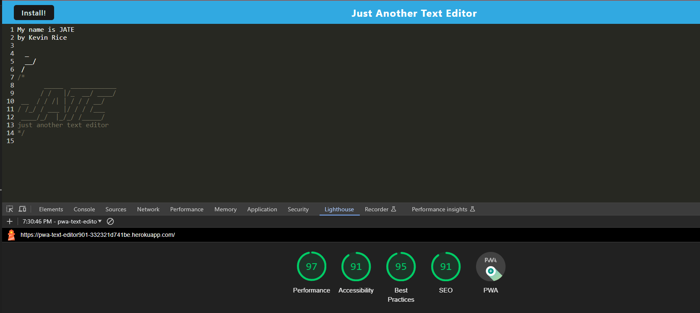

# Progressive Web Applications: Text Editor


# Description
This challenge is to build a text editor that runs in the browser. The app will be a single-page application that meets the PWA criteria. Additionally, it will feature a number of data persistence techniques that serve as redundancy in case one of the options is not supported by the browser. The application will also function offline.

## Table of Contents
* [Installation](#installation)
* [Functionalities](#functionalities)
* [Usage](#usage)
* [License](#license)
* [Contributing](#contributing)
* [Tests](#tests)
* [Questions](#questions)

## Installation
### The following dependencies required to run the application:

 __Rememember to ```npm init``` before installing these packages__

* [express.js](https://www.npmjs.com/package/express)

* [Webpack-cli](https://www.npmjs.com/package/webpack-cli)

* [ibd](https://www.npmjs.com/package/idb)

* [NodeJS](https://nodejs.org/en/download)

* [Nodemon](https://www.npmjs.com/package/nodemon)


## Functionalities
### A user can do the following things with this Note Taking App:
* CRUD Operations: Users should be to create new document, read existing ones,      update their conten and delete they're no longer needed.

* Offline Support: As a PWA, the text editor should be able to function offline. Changes made while offline should be saved and then synchronized when the user goes online again.

* Sync Across Devices: Changes made on one device should be reflected on all other devices where the user has the app installed.

* Rich Text Editing: The text editor might support bold, italics, underline, hyperlinks, and other rich text features.

* Auto Save: Changes to documents should be saved automatically, so users don't lose their work.


## Usage
```bash
node server.js
```
Lighthouse Analysis

Visit the app on Heroku
[URL Link](https://pwa-text-editor901-332321d741be.herokuapp.com/)

[Demonstration Video](https://drive.google.com/file/d/1CJW7ZeDCefmGsU6Jr-XKPUq3rY5HMOyC/view)
## License


## Contributing:
UCF Bootcamp Student Support


## Tests
```bash
node server.js
```
```bash
localhost:3000
```
```bash
heroku open
```

## Questions
This project was created by Kevin Rice; for additional questions, reach out to me at the following below:
* Author: [Kevin Rice](https://app.slack.com/client/T056YAJ4MPF/D05D0V54751)
* GitHub: [DirtyRice901](https://github.com/DirtyRice901/)
* Email: reatriniti@gmail.com 

---
© 2023 edX Boot Camps LLC. Confidential and Proprietary. All Rights Reserved.
